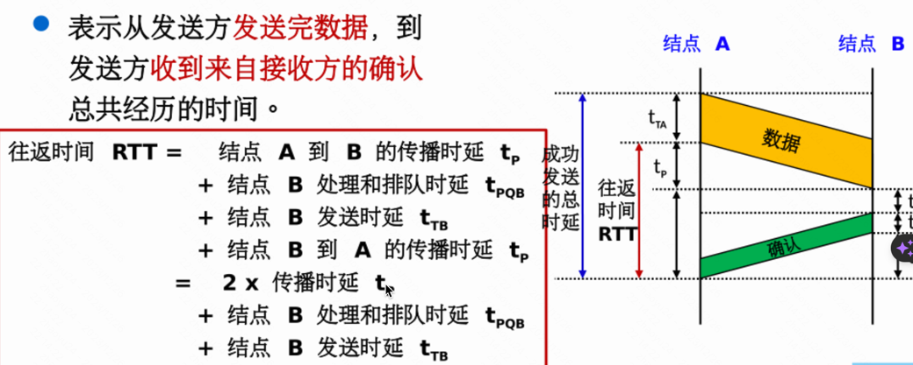
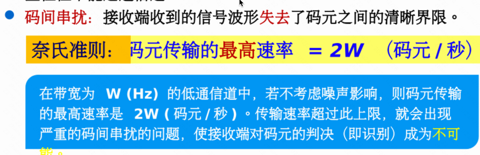
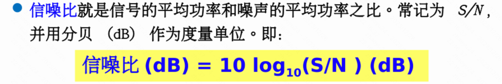
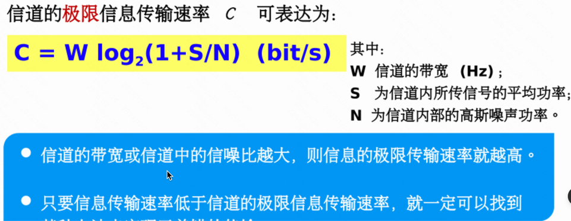
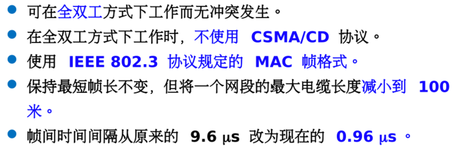
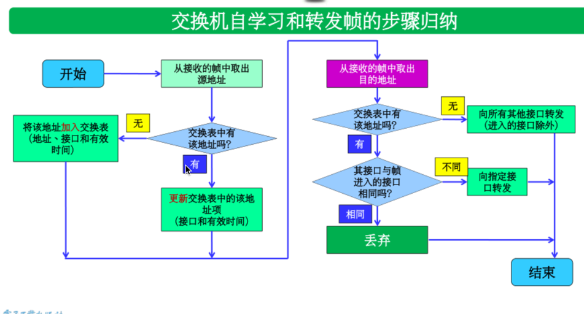
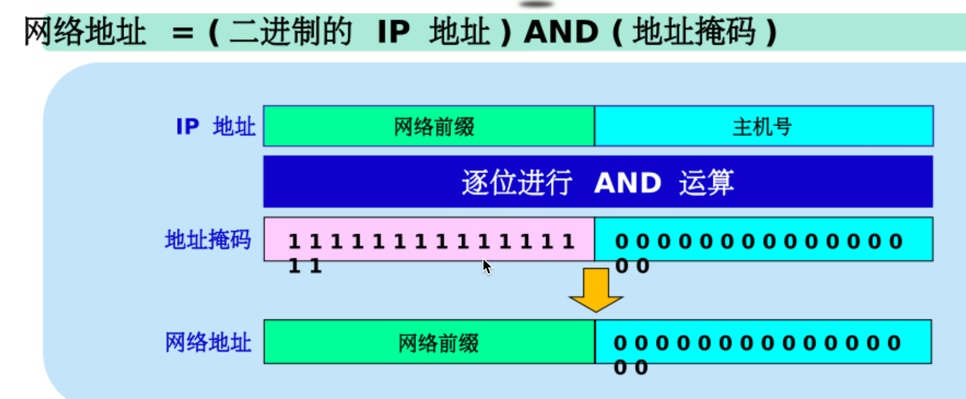

# 第一章 概述

## 计算机网络的概念

- 由若干节点和连接这些节点的链路组成

- 节点可以是计算机、集线器、交换机或者路由器

  

## 计算机网络的组成

- 边缘部分：由所有连接在互联网上的主机组成
- 核心部分：由大量网络和连接在这些网络的路由器组成

## 网络协议，协议与服务，网络协议的3个要素

- **语法**
- **语义**
- **定时**

## 协议分层，每一层的传送单元

### OSI模型：

1. **物理层（Physical Layer）：**
   - **功能：** 负责传输比特流，定义了硬件设备、电缆和信号的规范。
   - **传送单元：** 比特（Bit）。
2. **数据链路层（Data Link Layer）：**
   - **功能：** 提供点对点的可靠数据传输，通过物理地址（MAC地址）标识网络设备。
   - **传送单元：** 帧（Frame）。
3. **网络层（Network Layer）：**
   - **功能：** 负责数据包的路由和转发，通过逻辑地址（IP地址）标识网络设备。
   - **传送单元：** 数据包（Packet）。
4. **传输层（Transport Layer）：**
   - **功能：** 提供端到端的通信，负责数据的分段、传输控制和错误恢复。
   - **传送单元：** 段（Segment）。
5. **会话层（Session Layer）：**
   - **功能：** 管理会话、对话和数据交换。
   - **传送单元：** 数据。
6. **表示层（Presentation Layer）：**
   - **功能：** 处理数据的格式转换、加密和压缩。
   - **传送单元：** 数据。
7. **应用层（Application Layer）：**
   - **功能：** 提供用户接口、网络服务和应用程序。
   - **传送单元：** 数据。

### TCP/IP模型：

1. **链路层（Link Layer）：** 合并了OSI模型的物理层和数据链路层。

   - **传送单元：** 帧（Frame）。

2. **网络层（Internet Layer）：**

   - **传送单元：** 数据包（Packet）。

3. **传输层（Transport Layer）：**

   - **传送单元：** 段（Segment）。

4. **应用层（Application Layer）：**

   - **传送单元：** 消息（Message）。

   

## Everything over IP 与 IP over everything

1. **Everything over IP:**
   - 这个概念指的是将所有的通信和服务都基于互联网协议（IP）进行构建。这意味着几乎所有的网络应用、服务和通信都使用IP作为其基础协议。
   - 例如，VoIP（Voice over IP）表示语音通信通过IP网络进行，IPTV（Internet Protocol Television）表示通过IP网络传输的电视信号，等等。这种方法简化了网络架构，因为所有的通信都使用相同的协议栈。
2. **IP over everything:**
   - 这个概念指的是在不同的通信媒介上都使用IP协议。无论是在传统的有线网络、无线网络、传感器网络，甚至是物联网设备中，都使用IP来实现通信。
   - 这种方法的目标是在不同的物理层上统一协议，使得设备之间可以更方便地进行通信，而无需考虑底层网络的细节。IPv6的广泛采用支持了更多的IP地址，使得IP协议可以在更多设备和场景中被应用。

## C/S模式与P2P模式

### C/S模式（Client/Server模式）：

1. **结构特点：**
   - 在C/S模式中，网络被划分为客户端（Client）和服务器端（Server）两个主要组成部分。
   - 客户端是用户终端，负责向服务器发出请求，并接收和显示服务器返回的数据。
   - 服务器端则是中央计算机或主机，负责管理和存储数据，响应客户端的请求。
2. **通信方式：**
   - 通信是通过客户端向服务器发出请求，服务器响应这些请求的方式进行的。
   - 客户端和服务器之间的通信是单向的，客户端主动向服务器请求服务，而服务器被动地响应请求。
3. **特点：**
   - C/S模式具有明确的角色分工，服务器负责处理和存储数据，而客户端负责用户界面和用户交互。
   - 适用于中大型网络环境，有较好的集中管理和控制。

### P2P模式（Peer-to-Peer模式）：

1. **结构特点：**
   - 在P2P模式中，网络中的节点（Peer）既是客户端又是服务器，每个节点都可以提供和请求服务。
   - 所有的节点都是对等的，它们之间可以直接通信，无需中央服务器的干预。
2. **通信方式：**
   - 通信是直接在对等节点之间进行的，节点可以共享资源、服务和信息。
   - 没有中央服务器来管理通信，节点之间通过直接的点对点连接进行数据传输。
3. **特点：**
   - P2P模式强调分散化和去中心化，每个节点都可以充当服务的提供者和请求者。
   - 更具有灵活性，适用于小型网络环境，且不需要依赖单一的中央服务器。

### 比较：

- **C/S模式**适用于需要集中管理和控制的环境，例如企业网络、大型应用系统等。它有助于实现统一的数据管理和安全控制。
- **P2P模式**适用于小型网络环境，具有去中心化的特点，更具弹性和可扩展性。它常用于文件共享、即时通讯等场景。

## 比较电路交换、报文交换以及分组交换

### 1. 电路交换（Circuit Switching）：

- **连接方式：** 在通信建立之前，为通信双方建立一条专用的物理连接，这条连接在通信会话期间一直被保持。
- **资源占用：** 在通话期间，整条路径上的资源（带宽、传输设备等）都被占用，即使在通话双方不说话的时候也是如此。
- **时延：** 建立连接需要时间，通话时的时延较小，通话结束后释放资源。
- **应用场景：** 适用于对实时性要求高的应用，如电话通信。

### 2. 报文交换（Message Switching）：

- **连接方式：** 数据被划分成报文，每个报文独立发送。报文在网络中根据目标地址逐跳传输，最终到达目的地。
- **资源占用：** 资源仅在报文传输的时候被占用，传输结束后释放。
- **时延：** 传输时延较大，因为每个报文都要逐跳传输，可能会经过多个中间节点。
- **应用场景：** 适用于非实时性要求高，允许一定传输时延的通信应用，如电子邮件。

### 3. 分组交换（Packet Switching）：

- **连接方式：** 数据被划分成小的数据包（分组），每个数据包独立传输。数据包根据目标地址在网络中选择最优路径逐个传输。
- **资源占用：** 资源在数据包传输时被占用，传输结束后释放。
- **时延：** 传输时延相对较小，因为数据包可以选择不同路径传输，且可以并行传输。
- **应用场景：** 适用于各种通信应用，包括实时和非实时性要求，如互联网通信。

### 总体比较：

- **资源利用：** 电路交换占用资源较多，分组交换和报文交换能更灵活地利用网络资源。
- **时延：** 电路交换的时延较小，但资源利用不高，分组交换和报文交换的时延较大，但更具灵活性。
- **适用场景：** 电路交换适用于实时性要求高的应用，分组交换和报文交换适用于更灵活、各种需求的通信应用。

## 计算机网络的常用性能指标（信道容量、带宽、数据传输、速率、时延..）

1. **信道容量（Channel Capacity）：**

   - **定义：** 信道容量是指信道传输信息的最大速率，通常以比特每秒（bps）为单位。
   - **意义：** 表示信道传输信息的能力，是一个理论上的上限。

2. **带宽（Bandwidth）：**

   - **定义：** 带宽是指在单位时间内通过网络的最大数据传输量，通常以比特每秒（bps）为单位。
   - **意义：** 表示网络通信的能力，与信道容量有关，但通常带宽会受到实际网络环境和协议效率的影响。

3. **数据传输速率（Data Transfer Rate）：**

   - **定义：** 数据传输速率是指在网络中实际传输的数据量，通常以比特每秒（bps）为单位。
   - **意义：** 表示实际应用中数据传输的速度，受到网络带宽、协议效率等因素的影响。

4. **时延（Transmission Delay）：**

   - **定义：** 传输时延是指从数据开始在发送方发送到接收方接收完成所需的时间。

   - 组成部分：

     - **发送时延：** 是主机或路由器发送数据帧所需要的时间，也就是从发送数据帧的第一个比特算起，到该帧的最后一个比特发送完毕所需的时间。

       发送时延 = 数据帧长度（bit） / 发送速率（bit/s）

     - **传播时延：** 是电磁波在信道中传播一定的距离需要花费的时间

       传播时延 = 信道长度 （m）/ 信号在信道上的传播速率（m/s）

     - **处理时延：**主机或路由器在收到分组时，为处理分组(例如分首部提取数据差错检验或查找路由)所花费的时间。

     - **排队时延：** 分组在路由器输入输出队列中排队等待处理和转发所经历的时延排队时延的长短往往取决于网络中当时的通信量·当网络的通信量很时会发生队列溢出，使分组丢失，这相当于排队时延为无穷大。

5. **延迟带宽积（Delay-Bandwidth Product）：**

   - **定义：** 延迟带宽积是传播时延与带宽的乘积，表示在网络中能够容纳的最大比特数。
   - **意义：** 用于衡量网络的性能和容量，决定了在网络中最多可以存在多少未确认的比特。

6. **往返时延（Round-Trip Time，RTT）：**

   - **定义：** 往返时延是指从发送方发送数据到接收方返回确认所经历的时间。
   - **意义：** 衡量了数据从发送到接收并返回的总时间，影响通信的效率和交互的实时性。

## 主干网与接入网

### 主干网（Backbone Network）：

1. **定义：** 主干网是整个计算机网络的核心部分，用于连接不同的地域和子网络，传输大量的数据。主干网通常具有更高的带宽和更大的覆盖范围。
2. **特点：**
   - **高带宽：** 主干网通常具有高带宽，以满足大量数据的传输需求。
   - **覆盖范围广：** 主干网连接着不同的地域，跨足城市、国家甚至全球，形成一个大范围的网络基础设施。
   - **可靠性高：** 主干网通常采用冗余设计和高可用性的技术，以确保网络的稳定运行。
   - **主要任务：** 主要用于不同子网络之间的连接，承担跨越较大距离的数据传输任务。
3. **示例：**
   - 互联网的全球主干网，如由国际互联网骨干网提供的高速连接。

### 接入网（Access Network）：

1. **定义：** 接入网是用户设备与网络之间的连接部分，负责将用户接入到整个网络体系结构中。接入网通常是连接到主干网的最后一段网络。
2. **特点：**
   - **用户接入：** 接入网提供用户终端设备（如计算机、手机等）与网络之间的连接，允许用户访问网络服务。
   - **最后一英里：** 接入网通常被称为网络的“最后一英里”，因为它连接着用户设备与网络之间的最后一段距离。
   - **多样化：** 接入网可以采用多种技术，包括数字用户线路（DSL）、光纤、有线电视网络（CATV）、移动网络等。
   - **提供本地服务：** 接入网还可能提供一些本地服务，如局域网（LAN）连接、家庭网络服务等。
3. **示例：**
   - 家庭中的宽带互联网接入，可以通过光纤、DSL等技术实现。
   - 移动网络中的无线接入，允许移动设备通过无线信号连接到移动运营商的网络。

## 计算机网络的体系结构

### OSI模型（开放系统互连模型）：

OSI模型定义了计算机网络体系结构的七个层次，每个层次都负责特定的功能，层与层之间通过定义良好的接口进行通信。从最低层到最高层，这七个层次分别是：

1. **物理层（Physical Layer）：**
   - 主要关注传输比特流的硬件和物理介质，定义了电气特性、连接器和传输速率等。
2. **数据链路层（Data Link Layer）：**
   - 提供了点对点的可靠数据传输，包括物理地址（MAC地址）的定义、流量控制和错误检测。
3. **网络层（Network Layer）：**
   - 负责路由选择、数据包转发，通过逻辑地址（IP地址）标识设备，实现跨网络的数据传输。
4. **传输层（Transport Layer）：**
   - 提供端到端的通信，负责数据的分段、传输控制和错误恢复，常见的传输层协议有TCP和UDP。
5. **会话层（Session Layer）：**
   - 管理会话、对话和数据交换，负责建立、维护和结束会话。
6. **表示层（Presentation Layer）：**
   - 处理数据的格式转换、加密和压缩，确保数据在应用层之间的交换。
7. **应用层（Application Layer）：**
   - 提供用户接口、网络服务和应用程序，是网络与用户交互的最高层。

### TCP/IP模型：

TCP/IP模型是互联网协议套件的体系结构，将网络功能分为四个层次，从最低到最高分别是：

1. **链路层（Link Layer）：**
   - 对应于OSI模型的物理层和数据链路层，负责数据帧的传输和物理寻址。
2. **网络层（Internet Layer）：**
   - 对应于OSI模型的网络层，负责数据包的路由选择和跨网络的传输。
3. **传输层（Transport Layer）：**
   - 对应于OSI模型的传输层，提供端到端的通信，主要有TCP和UDP协议。
4. **应用层（Application Layer）：**
   - 对应于OSI模型的应用层，提供用户接口和应用程序。

## OSI与TCP/IP

OSI（Open Systems Interconnection）模型和TCP/IP模型都是计算机网络领域中常用的体系结构模型，用于描述和组织网络协议的功能。下面是它们之间的一些比较：

### OSI模型：

1. **层次结构：** OSI模型定义了七个层次，从最低到最高分别是物理层、数据链路层、网络层、传输层、会话层、表示层和应用层。
2. **通用性：** OSI模型被设计为通用的，可以适用于各种类型的计算机网络和通信系统。
3. **标准制定者：** OSI模型是由国际标准化组织（ISO）制定的，其目标是提供一个通用的框架，促进各种设备和协议的互操作性。
4. **未被广泛采用：** 尽管OSI模型提供了理论上的完整性和通用性，但在实际应用中并没有被广泛采用，因为它被认为过于复杂，而TCP/IP模型更为简洁实用。

### TCP/IP模型：

1. **层次结构：** TCP/IP模型定义了四个层次，从最低到最高分别是链路层、网络层、传输层和应用层。在实际使用中，应用层有时会包括表示层和会话层的功能。
2. **发展历史：** TCP/IP模型的发展是在实际应用中的经验基础上逐步形成的，最初是为互联网设计的。
3. **广泛采用：** TCP/IP模型成为实际互联网的事实标准，几乎所有的互联网应用都基于TCP/IP协议。
4. **实用性：** TCP/IP模型相对简单，更易于理解和实施，成为互联网上通信的主要框架。

### 比较：

- **通用性和复杂性：** OSI模型在通用性上胜过TCP/IP模型，但也因此显得更为复杂。TCP/IP模型的简洁性促使其在实际互联网应用中更为成功。
- **实际应用：** TCP/IP模型更符合实际互联网的需求，成为互联网上通信的事实标准。OSI模型虽然为网络理论提供了框架，但在实际应用中被广泛采用的是TCP/IP模型。

## OSI模型的主要贡献

OSI（Open Systems Interconnection）模型是国际标准化组织（ISO）制定的计算机网络体系结构的一种模型。该模型的主要贡献在于提供了一种标准化的、层次化的方法，用于描述和组织计算机网络中的各种功能和协议。以下是OSI模型的主要贡献：

1. **层次化结构：** OSI模型将计算机网络的功能划分为七个层次，每个层次都负责特定的功能，且层与层之间通过定义良好的接口进行通信。这种层次化结构使得网络的设计、维护和理解更为简化。
2. **标准化协议：** OSI模型定义了每个层次的功能，并促使了相关的标准协议的制定。不同的协议被制定用于实现每个层次的功能，这有助于确保不同厂商的设备和软件能够互操作。
3. **提供通用框架：** OSI模型提供了一个通用的框架，可用于描述各种计算机网络。这种通用性使得OSI模型成为网络设计和实施的基础，而不仅仅是用于特定类型的网络。
4. **分离硬件和软件：** OSI模型的层次化结构有助于分离硬件和软件，使得网络设备和协议的开发、维护和升级变得更加容易。不同层次的实现可以独立进行，而不影响其他层次。
5. **促进标准化和互操作性：** OSI模型的提出促使了对计算机网络的标准化工作，这有助于不同设备和厂商之间的互操作性。标准化的协议和接口使得不同厂商的设备可以协同工作。
6. **教育和培训工具：** OSI模型作为一种教育和培训工具，帮助学生和网络专业人员理解计算机网络的基本原理和组成部分。它为学习网络技术提供了一个结构化的框架。

## ARPANET的成功有何历史意义

1. **互联网的起源：** ARPANET是第一个成功的分组交换网络，采用了分布式、去中心化的架构。它的设计和实现为后来的互联网奠定了基础。ARPANET是互联网的原型，它的成功直接导致了今天全球性的互联网的形成和发展。
2. **开创性技术：** 在ARPANET的发展过程中，许多关键性的网络技术和协议得以诞生，包括分组交换、TCP/IP协议、以太网等。这些技术不仅为ARPANET提供了高效的通信手段，也成为后来互联网发展的基石。
3. **开放性的合作：** ARPANET的设计注重开放性和合作，这种开放的合作精神为互联网的发展打下了基础。网络协议的开放标准和互操作性成为互联网的核心特征，使得不同厂商和组织能够共同参与和贡献。
4. **信息共享：** ARPANET的目标之一是实现分布式计算和资源共享。这为全球范围内的信息共享和协同工作提供了先例，为后来的互联网应用、在线合作和信息传播打下了基础。
5. **创新文化：** 在ARPANET的发展过程中，涌现出许多计算机科学家和工程师，他们形成了一种开放、创新的文化。这种文化传承到了后来的互联网发展中，促使了许多创新和发明。
6. **敏捷性和韧性：** ARPANET的设计考虑了网络的韧性和敏捷性，使得网络能够适应不断变化的需求和环境。这种设计理念在互联网的发展中得以延续，使得互联网具有强大的适应性和韧性。

# 第二章

## 物理层的主要任务，确定与传输媒体接口的哪些特性？

任务：在连接各种计算机的传输媒体上传输数据比特流

- 机械特性: 指明接口所用接线器的形状和尺寸、引线数目和排列、固定和锁定装置等
- 电气特性:指明在接口电缆的各条线上出现的电压的范围
- 功能特性:指明某条线上出现的某一电平的电压的意义。
- 过程特性:指明对于不同功能的各种可能事件的出现顺序。

## 数据通信系统模型

- 源系统（发送端、发送方）
- 传输系统（传输网络）
- 目的系统（接收端、接收方）

## 调制解调器（MODEM）

在数字设备（例如计算机）之间传递模拟信号

1. **调制（Modulation）：** 在发送端，调制器将数字数据转换为模拟信号。这个过程涉及改变载波的某些特性，例如振幅、频率或相位，以便在传输媒介中传递数字信息。常见的调制方式包括调幅调制（AM）、调频调制（FM）、调相调制（PM）、调移键（ASK, FSK, PSK）等。

2. **解调（Demodulation）：** 在接收端，解调器将模拟信号转换回数字数据。这个过程涉及检测并还原调制信号中的数字信息。解调器识别调制信号的特定特征，并将其转换为原始的数字数据。

   

## 基带信号与调制信号，基带传输与调制传输（频带传输）

- **基带信号**：
  - 来自信源的信号
  - 包含有较多的低频成分

- **调制信号**： 调制信号是将基带信号与一个高频信号进行相互作用，从而将基带信号转移到一个更高频率范围的信号。
- **基带传输：** 基带传输是指直接传输未经调制的基带信号的方式
- **调制传输：** 调制传输是指通过调制将基带信号转移到一个较高频率范围

## 单工、双工、半双工

- 单工：只能有一个方向的通信，没有反方向的交互
- 半双工：通信的双方都可以发送信息，但不能同时发送（当然也就不能同时接受）
- 双工：通信的双方可以同时发送和接受信息

## 模拟信号数字化技术（PCM）

## 了解各种传输介质的性能差异

- 导引型传输媒体：电磁波被导引沿着固体媒体传播

  - 无屏蔽双绞线 UTP：
  - 屏蔽双绞线 STP：
  - 同轴电缆
  - 光纤

- 非导引型传输媒体：指自由空间

  

## 接入网（ADSL）

# 第三章 数据链路层

## 数据链路层的三个基本问题（帧定界、透明传输和差错检测）

- **帧定界（Frame Framing）：**
  - **问题描述：** 在传输的比特流中，如何识别出一个帧的起始和结束。
  - **解决方案：** 通过在数据帧的开始和结束位置使用特定的帧定界符或帧起始和帧结束标志来标识帧的边界。
- **透明传输（Transparent Transmission）：**
  - **问题描述：** 如何在传输过程中保证传输的比特流对于数据链路层是透明的，即不对传输的数据进行修改或处理。
  - **解决方案：** 采用一些技术手段，例如字符填充、字节填充或比特填充，以确保在帧中不出现与帧定界符相同的数据，避免歧义。
- **差错检测（Error Detection）：**
  - **问题描述：** 如何在数据传输中检测出可能由于噪声、干扰或其他问题引起的比特错误。
  - **解决方案：** 使用差错检测码，例如循环冗余校验（CRC）或帧检验序列（FCS），将附加的冗余信息附加到帧中，接收方可以使用这些信息检测是否有错误发生。

## CSMA/CD协议

载波监听多点接入 /碰撞检测。

- 多点接入: 说明这是总线型网络·许多计算机以多点接入的方式连接在一根总线上。

- 载波监听:即“边发送边监听”。不管在想要发送数据之前，还是在发送数据之中，每个站都必须不停地检测信道。

- 碰撞检测:适配器边发送数据，边检测信道上的信号电压的变化情况·电压摆动值超过一定的门限值时，就认为总线上至少有两个站同时在发送数据，表明产生了碰撞(或冲突

## 网卡，MAC层与MAC地址
- 网卡，是工作在OSI模型的数据链路层的网络组件。它是局域网中连接计算机和传输介质（如网线或WIFI信号）的接口。
网卡不仅能实现与局域网传输介质之间的物理连接和电信号匹配，
还涉及帧的发送与接收、帧的封装与拆封、介质访问控制、数据的编码与解码以及数据缓存的功能。

- MAC地址，也叫硬件地址，长度是48个bit（位），分为前24位和后24位：前24位叫做组织唯一标志符（Organizationally Unique Identifier，即OUI），
是由IEEE的注册管理机构给不同厂家分配的代码，区分了不同的厂家。后24位是由厂家自己分配的，称为扩展标识符。
MAC地址就如同身份证上的身份证号码，具有全球唯一性1。
## 数据链路层设备
- 网卡：网卡（Network Interface Card，NIC）是计算机连接网络的接口设备，它将计算机内部的数字信号转换为物理信号并发送到网络上1。网卡在数据链路层也扮演着重要的角色，它能够识别数据帧的MAC地址，并将数据帧传输到目标地址所在的网络中1。

- 网桥：网桥（Bridge）是用于连接两个网络的设备，它能够学习和识别MAC地址，并将数据帧转发到目标地址所在的网络中1。网桥能够控制数据流量，提高网络传输效率1。

- 交换机：交换机（Switch）是一种基于MAC地址进行转发的数据链路层设备，它能够连接多个设备并进行数据帧的交换1。交换机能够识别MAC地址并将数据帧转发到目标地址所在的端口，从而提高网络传输效率1。

## 冲突域与广播域
- 冲突域：指网络中的一个站点发出的帧会与其他站点发出的帧产生碰撞或冲突的那部分网络
- 广播域：任何一台设备发出的广播信号都能被该部分网络中的所有其他设备接受

## PPP协议
点对点协议（Point to Point Protocol，PPP）是Internet中广泛使用的数据链路层通信协议，它为点对点链路上直接相连的两个结点之间提供了一种数据传输的方式1。PPP最初设计是为两个对等节点之间的IP流量传输提供一种封装协议2。PPP是大多数个人计算机和ISP之间使用的协议，在高速广域网上也有一定的应用1。

PPP协议主要由以下三部分构成：

- 对各种协议数据报的封装方法（封装成帧）
- 链路控制协议LCP：用于建立、配置以及测试数据链路的连接
- 一套网络控制协议NCP：其中的每一个协议支持不同的网络层协议
PPP协议的帧格式包括标志字段、地址字段、控制字段、协议、信息部分和FCS校验和字段3。PPP协议还具有透明传输和差错检测的功能。

PPP协议在建立、保持和终止PPP链路的过程中，需要经过5个阶段，除认证阶段外，其它4个阶段都是必要过程3。这5个阶段分别是：链路不可用阶段（Dead）、链路建立阶段（Establish）、认证阶段（Authenticate）、网络层协议阶段（Network）和链路终止阶段（Terminate）3。

PPP协议还具有处理错误检测、支持多个协议、允许在连接时刻协商IP地址、允许身份认证等功能2。PPP协议可以用于多种类型的物理介质上，包括串口线、电话线、移动电话和光纤（例如SDH），PPP也用于Internet接入2。

##  以太网，10BASE-T
- 快速以太网
- 在双绞线上传送100Mbit/s基带信号的星形拓扑以太网
- 仍使用IEEE 802.3的CSMA/CD

## VLAN
- 虚拟局域网VLAN：是由一些局域网网段构成的与物理位置无关的逻辑组
1. 改善了性能
2. 简化了管理
3.  降低了成本
4. 改善了安全性

## 共享局域网和交换式局域网
- 共享式局域网：在共享式局域网中，所有设备共享同一个网络媒介（如以太网）来传输数据1。这意味着当多个设备同时发送数据时，会发生冲突，造成数据包丢失或重传1。共享式局域网采用CSMA/CD（载波监听多点接入/碰撞检测）协议来避免冲突，并确保数据的正常传输1。共享式局域网中所有用户共享带宽，每个用户的实际可用带宽随网络用户数的增加而递减1。

- 交换式局域网：在交换式局域网中，每个设备连接到交换机的一个独立端口1。交换机根据MAC地址来转发数据包，将数据从源设备直接传输到目标设备，而不需要与其他设备共享媒介1。这种方式避免了冲突，提供更高的数据传输效率和带宽1。交换式局域网可以同时支持全双工通信，允许设备同时发送和接收数据，提高了网络的性能和可靠性1。

## 交换机自学习

# 第四章 网络层
## IP地址、掩码、地址块
- IP地址：IP地址是主机的唯一标识，保证主机间正常通信。它是一种网络编码，用来确定网络中的节点。IP地址是由32位二进制组成，通常被分割为4个“8位二进制数”（也就是4个字节）。分成4组，每组8位。

- 子网掩码：子网掩码又叫网络掩码、地址掩码、子网络遮罩。它是一种用来指明一个IP地址的哪些位标识的是主机所在的子网，以及哪些位标识的是主机的位掩码。子网掩码也是一个32位地址，只有一个作用：就是将某个IP地址划分成网络地址和主机地址两部分1。对于A类地址来说，默认的子网掩码是255.0.0.0；对于B类地址来说，默认的子网掩码是255.255.0.0；对于C类地址来说，默认的子网掩码是255.255.255.0。

- 地址块：地址块是指在IP地址空间中，由于子网划分而形成的一组连续的IP地址集合2。例如，一个主机的IP地址是202.112.14.137，掩码是255.255.255.224，要求计算这个主机所在网络的网络地址和广播地址。子网掩码255.255.255.224转二进制：11111111.11111111.11111111.11100000。其中网络位部分是27位，主机位部分是5位。网络地址就是：把IP地址转成二进制和子网掩码进行与运算。IP地址202.112.14.137转二进制：11001010 01110000 00001110 10001001。IP地址&子网掩码 11001010 01110000 00001110 10001001 11111111 11111111 11111111 11100000 11001010 01110000 00001110 10000000。结果为：202.112.14.128。广播地址计算：网络地址的主机位全部变成1 ，10011111 即159 即：202.112.14.159。

## 分类的IP地址与CIDR，网络地址与端口地址
- 分类的IP地址：在早期的IP地址设计中，IP地址被分为A类、B类和C类1。每个类别的地址都有固定的网络号和主机号的位数1。例如，A类地址的网络号占8位，B类地址的网络号占16位，C类地址的网络号占24位1。

- CIDR：CIDR（无类别域间路由）是一种新的IP地址分配方法，它取代了基于A类、B类和C类的旧系统12。CIDR允许单个IP地址表示许多唯一的IP地址1。CIDR IP地址看起来像一个普通的IP地址，只是在后面加了一个斜线和一个数字，这个数字被称为IP网络前缀1。例如，192.0.2.0/24是一个IPv4 CIDR地址，其中前24位（即192.0.2）是网络地址2。

- 网络地址：网络地址是IP地址的一部分，用于标识主机所在的网络3。网络地址是通过将IP地址和子网掩码进行AND运算得到的3。例如，如果一个主机的IP地址是202.112.14.137，子网掩码是255.255.255.224，那么网络地址就是202.112.14.1283。

- 端口地址：端口地址（也称为服务点）用于标识站点上的应用程序4。在网络编程中，我们可以使用IP地址或域名来标识网络上的一台设备5。然而，实际上是通过“IP地址+端口号”来区分不同的服务的5。端口号就是唯一的表示这些进程的编号6。例如，HTTP服务通常使用端口80，而HTTPS服务通常使用端口4435。

## 首部校验，Best effort
- 首部校验：首部校验是网络通信中常用的一种校验方法，用于验证数据包在传输过程中是否出现了错误或损坏1。例如，IP首部校验和的计算方法包括以下步骤1：
把校验和字段以全零填充； 对每16位（2字节）进行二进制反码求和 对得到的结果即为首部校验和。
- Best effort：Best effort是一种服务质量（QoS）等级，它表示网络将尽其所能地传输数据，但不保证数据的传输质量2。在没有足够的网络资源（如带宽、缓冲区等）的情况下，网络可能会丢弃或延迟传输数据包2。这种服务模式常用于互联网，因为互联网的设计原则是尽最大努力服务，而不提供任何质量保证2。在这种模式下，所有的数据包都被视为同等重要，不区分优先级2。因此，Best effort服务模式适用于对实时性要求不高的应用，如电子邮件和网页浏览2。然而，对于需要高质量服务的应用（如VoIP和在线游戏），Best effort服务可能无法满足其服务质量要求2。这就需要使用其他的服务质量机制，如差分服务（DiffServ）和集成服务（IntServ）2
## ARP，ICMP（ping，tracert）
- ARP（地址解析协议）：ARP是一种用于发现链接层地址（如MAC地址）的通信协议，这种地址与给定的互联网层地址（通常是IPv4地址）相关联12。ARP的主要功能是找出主机的硬件地址，也称为媒体访问控制（MAC）地址，从其已知的IP地址2。

- ICMP（互联网控制消息协议）：ICMP是一种网络协议，用于网络设备（如路由器和主机）之间传递错误消息和操作信息3。

- Ping：Ping是基于ICMP协议的一个常用工具，用于查看设备是否在线以及网络连接是否完整34。Ping通过发送ICMP回声请求到目标主机，如果设备可用，它会回复一个ICMP回声应答3。Ping命令还可以用来检查数据包丢失。当你运行ping命令时，它会发送一系列数据包到指定的目标并等待响应。如果任何数据包丢失或未收到响应，ping命令将报告丢失的数据包的百分比3。

- Tracert：Tracert是一个路由跟踪实用程序，用于确定IP数据报访问目标所采取的路径5。Tracert命令通过发送逐渐增加生存时间（TTL）字段值的ICMP回声请求或ICMPv6消息到目标，来确定从一个主机到网络上其他主机的路由5。Tracert工具可以查看数据包的整条传输路径，包括途中经过的中间设备6。
## 网络层设备
网络层的设备主要包括路由器和三层交换机1234。

- 路由器：路由器是网络层设备，主要作用是将数据包从源地址传输到目的地址。它的工作原理是通过查找路由表，选择最佳路径将数据包传输到目标网络中1234。与交换机不同，路由器能够在不同的网络之间进行数据传输，因此它通常是不同网络之间的网络连接点1234。路由器通常会使用一些协议来构建和维护路由表，比如常见的动态路由协议有RIP、OSPF、BGP等1234。路由器也可以进行一些高级的功能，比如NAT、VPN等，用于网络安全和管理1234。

- 三层交换机：三层交换机是一种特殊的交换机，它在数据链路层的基础上增加了网络层的功能1234。这意味着三层交换机不仅可以根据MAC地址进行数据帧的转发，还可以根据IP地址进行数据包的路由1234。这使得三层交换机可以在不同的网络之间进行数据传输，提供了更高的数据传输效率和带宽1234。

## 路由协议（OSPF、RIP、BGP-4），路由表
- OSPF（开放最短路径优先）1：OSPF是一种动态路由协议，也是一种链路状态协议。它具有路由变化收敛速度快、无路由环路、支持变长子网掩码（VLSM）和汇总、层次区域划分等优点。我们一般在网络中使用OSPF协议后，大部分路由能将OSPF协议自行计算和生成，无须人工配置，当网络发生变化时，协议自动计算、更正路由，方便网络管理。

- RIP（路由信息协议）23：RIP是一种基于距离矢量（Distance-Vector）算法来计算到达目的网络的最佳路径路由协议，它通过UDP报文进行路由信息的交换，使用的端口号为520，RIP是基于跳数（最多支持15跳）来衡量到达目的地址的距离，称为度量值，RIP协议有多个版本，分为v1/v2/ng版。

- BGP-4（边界网关协议第四版）45：BGP-4提供了一套新的机制以支持无类域间路由。这些机制包括支持网络前缀的通告、取消BGP网络中“类”的概念。BGP-4也引入机制支持路由聚合，包括AS路径的集合。

- 路由表：在计算机网络中，路由表或称路由择域信息库（RIB, Routing Information Base），是一个存储在路由器或者联网计算机中的电子表格（文件）或类数据库。路由表存储着指向特定网络地址的路径（在有些情况下，还记录有路径的路由度量值）。
## IPV6，MPLS，NAT，NATP，隧道技术
- IPv6：IPv6（Internet Protocol Version 6）是互联网协议的最新版本，它提供了一种用于在网络上为计算机提供标识和定位系统的通信协议1。IPv6由互联网工程任务组（IETF）开发，以解决IPv4地址耗尽的长期预期问题，并旨在取代IPv41。IPv6使用128位地址，理论上允许2128，或大约3.4×1038个总地址1。

- MPLS：多协议标签交换（MPLS）是一种设计用于将数据包快速有效地传送到其目的地的协议2。MPLS不是产品或服务，而是一种指定发送数据的路径而不是端点的技术2。当数据包首次进入网络时，它被分配到一个转发等价类（FEC），该类决定了数据包的转发方式2。

- NAT：网络地址转换（NAT）是一种服务，使私有IP网络能够使用互联网和云3。NAT将内部网络中的私有IP地址转换为公共IP地址，然后将数据包发送到外部网络3。

- NATP：NATP可能指的是美国税务专业人员协会（National Association of Tax Professionals），这是一个组织，它提供了各种资源和服务，包括税务教育、联邦税务研究、税法洞察和其他服务和供应4。

- 隧道技术：隧道技术是一种利用互联网中的基础设施进行数据传递的方式，建立了一个安全的传输环境，提高了数据传输的兼容度5。隧道技术应用不同协议的数据帧或数据包封装后可在隧道内进行传递，但隧道两端的收发设备必须使用同一隧道协议5。此外，隧道技术还可用于传输负载
## SDN，SDN体系结构的四个关键特征
- SDN（软件定义网络）：SDN是一种新的网络架构，它通过将控制平面从数据转发功能中抽象出来，实现了网络的集中管理1。SDN的主要目标是使网络更加灵活和易于管理1。

- SDN体系结构的四个关键特征包括：
  - 基于流的转发：在SDN中，流表规定了转发规则，即数据包应该如何从源地址传输到目标地址。
   - 数据层面与控制层面分离：在SDN中，网络控制功能位于数据层面交换机之外，用软件实现。这意味着控制平面和数据平面是分开的，它们不在同一个设备中。
    - 网络控制功能集中化：SDN提供了一种集中式的网络控制方法，使得网络管理更加集中和统一。
    - 可编程的网络：SDN允许网络管理员或网络运营商通过编程来配置、管理和优化网络资源，从而提高网络的灵活性和可扩展性
## IPV6地址的零压缩
IPv6地址的零压缩是一种简化IPv6地址表示的方法1。以下是两种常见的压缩方法：

- 零压缩（Zero Compression）：如果在一个IPv6地址存在连续多个字段的0时，可以用两个冒号::来代替。注意，这类零压缩最多只能出现一次，即在每个IPv6地址中只能出现一个::1。例如，源格式：1234:1234:0000:0000:0000:0000:3456:3434，压缩后：1234:1234::3456:34341。

- 前导零压缩（Leading Zero Compression）：在任意的16-bit的字段中，前导的0（leading zeros）可以被丢弃，但每个字段至少要保留有一位数1。因此，如果一个字段全为0，那么你必须留一个0来表示该字段1。例如，原格式：1234:0000:1234:0000:1234:0000:0123:1234，压缩后：1234:0:1234:0:1234:0:123:12341。

总结起来，零压缩在每个IPv6地址中只允许出现一次，而前导零压缩可以出现任意次数1。这些规则使得IPv6地址的表示更加简洁，便于阅读和书写。

# 第五章 传输层
## 网络层是为主机之间提供逻辑通信，而运输层为应用进程之间提供端到端的逻辑通信

## TCP与UDP
- TCP是一种面向连接的协议，它在传输数据之前会建立一条专用的通信连接123。TCP提供了一种可靠的、基于字节流的传输方式123。在TCP中，数据的传输是可靠的，因为它使用了确认机制来确保数据包已经被接收123。此外，TCP还提供了流量控制和拥塞控制机制，以确保数据的顺序传输和网络的稳定性123。

- UDP是一种无连接的协议，它不会建立专用的通信连接123。UDP提供了一种简单的、面向数据报的传输方式123。在UDP中，数据的传输是不可靠的，因为它不使用确认机制，所以数据包可能会丢失123。此外，UDP没有流量控制和拥塞控制机制，因此它的传输速度可能会非常快，但也可能会导致网络拥堵
## 伪首部
- 在UDP伪首部中，包含32位源IP地址，32位目的IP地址，8位协议，16位UDP长度1。通过伪首部的校验，UDP可以确定该数据报是不是发给本机的，通过首部协议字段，UDP可以确认有没有误传1。

- 在TCP伪首部中，包含了IP首部的一些字段，有如下信息：32位源IP地址、32位目的IP地址、8位保留字节 (置0)、8位传输层协议号 (TCP是6，UDP是17)、16位报文长度 (首部+数据)3。伪首部是为了增加校验和的检错能力：通过伪首部的目的IP地址来检查TCP报文是否收错了、通过伪首部的传输层协议号来检查传输层协议是否选对了3。
## TCP支持的应用

- FTP（文件传输协议）：FTP是一种用于在网络上进行文件传输的协议123。
- SSH（安全外壳协议）：SSH是一种网络协议，用于在不安全的网络中提供安全的远程登录和其他安全网络服务123。
- Telnet（远程登录协议）：Telnet是一种用于在互联网或局域网上进行远程登录的协议123。
- SMTP（简单邮件传输协议）：SMTP是一种用于发送电子邮件的协议123。
- HTTP（超文本传输协议）：HTTP是一种用于分布式、协作式和超媒体信息系统的应用层协议1
## 端口

## 滑动窗口与流量控制

- 滑动窗口：滑动窗口是一种流量控制方法，它允许发送方在停止并等待确认前可以连续发送多个分组5。发送方会维护一个发送窗口，接收方会维护一个接收窗口，通过动态调整窗口大小和拥塞控制机制，确保数据的可靠传输和网络的稳定性1234。当收到的数据序列号在左边界和右边界之间时，才会接收保存，这样窗口才会向前移动，所以形象地称之为滑动窗口5。

- 流量控制：流量控制是一种机制，它通过控制发送方的数据发送速度来防止接收方被淹没1234。为了解决网络上数据流量超过网络硬件负荷时出现的网络拥塞问题，TCP引入了流量控制，顾名思义，就是采用某种方法，控制收发端传输数据的速度，从而维持网络数据传输的平衡1234。

## TCP连接的建立与释放（三报文握手与四报文挥手）
- TCP连接的建立（三次握手）123：

  - 第一次握手：客户端发送一个SYN包（SYN=x）到服务器，请求建立连接123。
  - 第二次握手：服务器收到SYN包后，返回一个SYN+ACK包（SYN=y，ACK=x+1），确认连接请求123。
  - 第三次握手：客户端收到SYN+ACK包后，发送一个ACK包（ACK=y+1），确认连接建立123。
 
- TCP连接的释放（四次挥手）123：

  - 第一次挥手：客户端发送一个FIN包（FIN=1，seq=u）到服务器，请求关闭连接123。
  - 第二次挥手：服务器收到FIN包后，返回一个ACK包（ACK=u+1，seq=v），确认关闭请求123。
  - 第三次挥手：服务器发送一个FIN包（FIN=1，ACK=1，seq=w，ack=u+1），请求关闭连接123。
  - 第四次挥手：客户端发送一个ACK包（ACK=1，seq=u+1，ack=w+1），确认关闭连接1

# 第六章 应用层

## 域名和DNS
- 域名是由一串用点分隔的名字组成的Internet上某一台计算机或计算机组的名称，用于在数据传输时对计算机的定位标识1。例如，我们通常使用www.google.com而不是其IP地址来访问Google的网站，因为域名更容易记忆1。

- **DNS（域名系统）**是一种服务，它将人类可读的网站名称（例如www.google.com）转换为机器可读的IP地址（例如192.0.2.0）2。这种转换过程称为DNS解析2。DNS服务器中保存了一张域名和与之相对应的IP地址的表，以解析消息的域名3。

- 当你在浏览器中输入一个网址时，你的计算机会使用DNS来查找该网址对应的IP地址。然后，你的计算机会向该IP地址发送请求，请求网站的内容2。这就是DNS如何使我们能够通过输入易于记忆的网址来访问网站的2。
## HTTP与WWW
- HTTP：HTTP是一种用于从万维网（WWW）服务器传输超文本到本地浏览器的传送协议1。所有的WWW文件都必须遵守这个标准1。HTTP协议采用了请求/响应模型3。客户端向服务器发送一个请求，请求头包含请求的方法、URI、协议版本、以及包含请求修饰符、客户信息和内容的类似于MIME的消息结构3。服务器以一个状态行作为响应，相应的内容包括消息协议的版本，成功或者错误编码加上包含服务器信息、实体元信息以及可能的实体内容3。

- WWW：WWW是环球信息网的缩写，也可以简称为Web，中文名字为“万维网”2。WWW是一个由许多互相链接的超文本组成的系统，通过互联网访问2。在这个系统中，每个有用的事物，称为一样“资源”；并且由一个全局“统一资源标识符”（URI）标识；这些资源通过超文本传输协议（HTTP）传送给用户，而后者通过点击链接来获得资源2。
## URL
统一资源定位符（Uniform Resource Locator，URL），也被称为Web地址，是一种引用和获取计算机网络上资源位置的方式12。URL是一种特定类型的统一资源标识符（URI），尽管许多人将这两个术语互换使用1。

URL的主要组成部分包括12：

- 协议：例如http或https，它指定了如何访问资源。
- 主机名：这是资源所在的服务器的名称，可以是域名或IP地址。
- 端口号：这是可选的，用于指定服务器上的特定进程。
- 路径：这是服务器上资源的具体位置。
## SMTP与POP（POP3）
- SMTP：SMTP是一种用于发送电子邮件的协议1。它定义了电子邮件的传输方式，负责将邮件从发件人的电子邮件服务器发送到接收人的电子邮件服务器1。SMTP负责处理邮件的路由和传输，确保邮件能够准确地传递到目标服务器1。

- POP3：POP3是一种用于接收电子邮件的协议1。它允许用户从邮件服务器上下载和接收邮件1。POP3协议使用户能够通过客户端应用程序（如Outlook、Thunderbird等）访问和管理邮件服务器上的收件箱1。
## 哪些应用层协议的下层使用TCP？
- HTTP（超文本传输协议）：HTTP是一种用于分布式、协作式和超媒体信息系统的应用层协议1。

- FTP（文件传输协议）：FTP是一种用于在网络上进行文件传输的协议1。

- SMTP（简单邮件传输协议）：SMTP是一种用于发送电子邮件的协议1。

- TELNET（远程登录协议）：Telnet是一种用于在互联网或局域网上进行远程登录的协议1。

- SSH（安全外壳协议）：SSH是一种网络协议，用于在不安全的网络中提供安全的远程登录和其他安全网络服务1。
## 哪些应用层协议的下层使用UDP？
- DNS（域名系统）：DNS是一种服务，它将人类可读的网站名称（例如www.google.com）转换为机器可读的IP地址（例如192.0.2.0）1。

- TFTP（简单文件传输协议）：TFTP是一种简单的文件传输协议，它允许用户从邮件服务器上下载和接收邮件1。

- SNMP（简单网络管理协议）：SNMP是一种网络协议，用于管理TCP/IP网络中的设备
# 第九章 无线网络和移动网络

## 有固定基础设施和无固定基础设施的WLAN
- 有固定基础设施的无线局域网：这种网络中已经预先存在了一批固定的数据处理和转发设备，这些固定设备可以通过有线方式连接其他网络或Internet1。在这种网络中，无线设备（如笔记本电脑或智能手机）通过无线方式与接入点（AP）相连，再由AP通过有线介质连接其他网络或Internet1。

- 无固定基础设施的无线局域网：这种网络中的每个成员都是对等的可移动设备1。这种网络通常用于临时会议或者无法布线的地方，比如在一个会议室里，笔记本电脑可以直接互相通信，而不需要通过接入点1。
## CSMA/CA
- 载波感知：设备在发送数据之前会先监听信道，以确保信道当前未被其他设备使用2。
- 冲突避免：如果设备听到其他设备正在发送数据，它会等待一段时间（通常是随机的）再次监听信道2。
- 请求发送/清除发送（RTS/CTS）：这是一种可选的机制，用于在设备之间协调对信道的访问